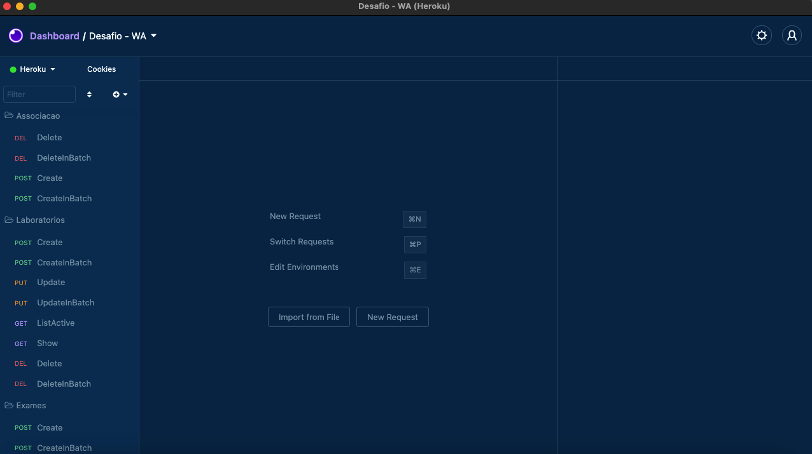

# WA Challenge

 O desafio consiste em, construir uma API para manutenção de laboratórios e exames




Projeto criando em 

## Tecnologias & Ferramentas


## Building

# Opção 1

Você precisa do [Node.js](https://nodejs.org) instalado no seu computador para construir este servidor.

```bash
git clone https://github.com/nettonucci/nodejs-coding.git
$ cd nodejs-coding
$ yarn install
$ yarn dev
```
# Opção 2
# Diferenciais 1 (Configurar a aplicação para rodar em um container)

Você precisa do [Docker](https://www.docker.com/) instalado no seu computador para construir este servidor.

```bash
git clone https://github.com/nettonucci/nodejs-coding.git
$ cd nodejs-coding
$ docker-compose up
```
## Utilização sem instalação/building

# Diferenciais 2 (Publicação do ambiente em um serviço cloud de hospedagens (Heroku))

Para utilizar os endpoints da API sem a instalação/building na maquina, um servidor foi alocado no Heroku, esta disponivel [Aqui](https://wa-challenge.herokuapp.com/).

# Diferenciais 3 (Documentação da API)

Você precisa do [Insomnia](https://insomnia.rest/download) instalado no seu computador para realizar os testes no servidor.

Basta baixar [aqui](https://github.com/nettonucci/nodejs-coding/tree/main/insomnia) o JSON que deixei, contendo todas as rotas necessarias para o funcionamento do servidor.

# Netto Nucci

[](https://github.com/nettonucci/nettonucci)